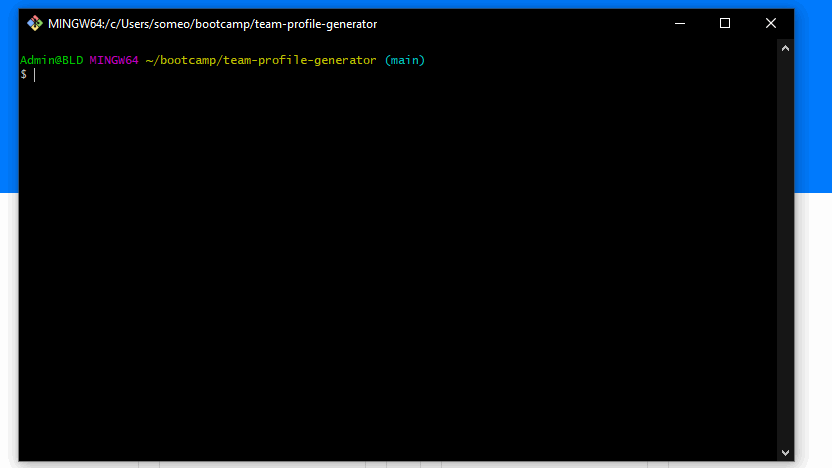

# Team Profile Generator

Command-line tool that creates a webpage for your team's employees.

---

## About

Use this tool to automatically create a webpage for you and your employees. Simply run the tool, input profile information about you and your employees, and a webpage will be generated for you with no additional configuration needed.

---

## Installation

1. Clone the repo or download the code as a zip.
   
`git clone https://github.com/LemonPocky/team-profile-generator.git`

2. If downloaded as zip, unzip the contents. Place the folder in an easily accessible location on your computer.
   
3. Navigate to the root folder using the terminal or other command-line interface.

4. Run the following commands:
   
   `npm install`

   `node index.js`

5. Follow the on-screen prompts.

---

## Technologies

Runs on [Node.js](https://nodejs.org/en/about/)

Prompts generated by [inquirer](https://www.npmjs.com/package/inquirer)

HTML page made with [Bootstrap](https://getbootstrap.com/)